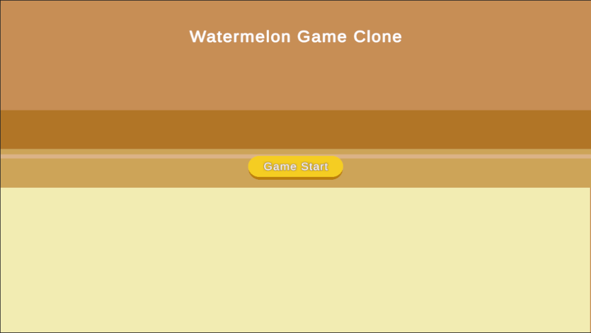
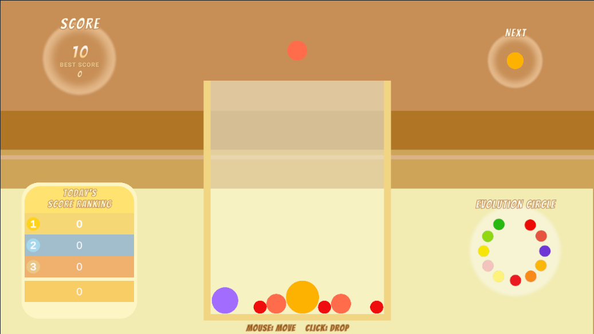

# Watermelon Game Clone

"Watermelon Game" is a puzzle game that combines the systems of a falling object puzzle game and a merge game.  
This repository aims to clone that game in Unity.

## GameScenes

- [x] Main scene
- [x] Title scene

## Features

### Title scene

#### Out Game

- [x] Start button: Click to move to main scene
- [ ] My Score button: Click to move to score scene?
- [ ] How to play button: Click to move to how to play scene?
- [ ] language choice

### Main scene

#### In Game

- [ ] Direction before the game starts
- [x] Move the sphere before it falls with the mouse
- [x] Click to drop the sphere
- [x] Merge fallen spheres
- [x] Display scores by merging
- [x] Game over when reaching a certain height
- [x] Display your highest score so far
- [x] Play sound effects
- [ ] Display the next operable sphere
- [ ] Display today's score ranking
- [ ] Display the circle of evolution

#### Out Game

- [x] Restart button: Click to move to initialized main scene
- [ ] My Score button: Click to move to Score Scene?
- [x] Back to title button: Click to move to title scene

## Requirements

Unity 2021.3.11f1 LTS or later

## References

<https://nosystemnolife.com/suicaclone001/>
